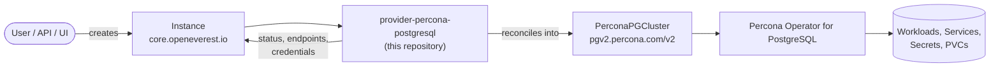

# Percona Distribution for PostgreSQL Provider

[](https://github.com/openeverest/provider-percona-postgresql/actions/workflows/ci.yaml)
[](https://pkg.go.dev/github.com/openeverest/provider-percona-postgresql)
[](LICENSE)

Run **Percona Distribution for PostgreSQL** on Kubernetes through
[OpenEverest](https://github.com/openeverest/openeverest), backed by the
[Percona Operator for PostgreSQL](https://github.com/percona/percona-postgresql-operator).

## What this is

OpenEverest providers translate a single, technology-agnostic `Instance` custom resource into
the native custom resources of an upstream Kubernetes operator — for databases, but equally
for caches, message queues, object storage, or model-serving runtimes. This repository is the
provider for **PostgreSQL**: it owns the technology-specific knowledge — topologies, versions,
parameters, backup wiring — so that users, the API server, and the UI stay
technology-agnostic.

> [!IMPORTANT]
> **This provider is not standalone.** It requires an OpenEverest installation (core CRDs and
> controller) in the cluster. Installing this chart on its own does nothing.
> See [Install OpenEverest](https://openeverest.io/documentation/current/quick-install.html).



The provider watches `Instance` resources whose `spec.providerRef.name` is
`provider-percona-postgresql`, and reports workload health back onto `Instance.status`. It
never manages pods directly — all lifecycle work is delegated to the operator.

## Compatibility

This provider has **not been released yet** — the table describes `main`.

| provider-percona-postgresql | OpenEverest | Percona Operator for PostgreSQL | Kubernetes |
|---|---|---|---|
| `main` | `>= 2.0.0` | `3.0.x` | `1.30` – `1.34` |

## Capabilities

| Capability | Status | Notes |
|---|---|---|
| Provisioning | ✅ | |
| Horizontal scaling | ✅ | `spec.components.<name>.replicas` |
| Vertical scaling (CPU / memory) | ✅ | `spec.components.<name>.resources` |
| Version upgrades | ✅ | change `spec.version`; see [Versions](#versions) |
| Custom configuration | ❌ | not yet exposed through the Instance API |
| Monitoring | ❌ | planned |
| TLS | ⚠️ | the operator provisions certificates; nothing is exposed through the Instance API |

Stateful workloads additionally report:

| Capability | Status | Notes |
|---|---|---|
| Persistent storage | ✅ | `spec.components.engine.storage` |
| Storage expansion | ✅ | when the StorageClass allows volume expansion |
| Backups (on demand) | ❌ | planned; pgBackRest images are already catalogued |
| Backups (scheduled) | ❌ | planned |
| Point-in-time recovery | ❌ | planned |
| Restore | ❌ | planned |

## Installation

> [!NOTE]
> There is no published chart yet. Until the first release, install from a checkout.

```bash
git clone https://github.com/openeverest/provider-percona-postgresql.git
cd provider-percona-postgresql
helm dependency build charts/provider-percona-postgresql
helm install provider-percona-postgresql charts/provider-percona-postgresql \
  --namespace everest-system
```

`make helm-install` does the same thing against your current kube context.

- The Percona Operator for PostgreSQL is bundled as a chart dependency and installed by
  default. Set `pg-operator.enabled=false` when the cluster already runs it.

Uninstall:

```bash
helm uninstall provider-percona-postgresql --namespace everest-system
```

Uninstalling the chart does **not** delete running `Instance` resources or their data.

## Usage

Verify that the provider registered itself:

```bash
kubectl get providers.core.openeverest.io provider-percona-postgresql
```

Create an instance:

```yaml
apiVersion: core.openeverest.io/v1alpha1
kind: Instance
metadata:
  name: my-instance
spec:
  providerRef:
    name: provider-percona-postgresql
  components:
    engine:
      type: postgresql
      replicas: 3
      resources:
        requests:
          cpu: 500m
          memory: 2G
      storage:
        size: 10Gi
```

Component names are defined by this provider — see [definition/provider.yaml](definition/provider.yaml).
`spec.version` and `spec.topology` are optional; the provider defaults apply.
More examples live in [examples/](examples/).

Watch it come up and read the connection details:

```bash
kubectl get instance my-instance -w
kubectl get instance my-instance -o jsonpath='{.status.connection}'
```

Credentials are in the secret named by `.status.connection.credentialsSecretRef`.

## Topologies

<!-- BEGIN GENERATED: topologies -->
| Topology | Default | Description |
|---|---|---|
| `cluster` | ✅ | Primary plus replicas (3 `engine` instances by default), fronted by 2 pgBouncer `proxy` replicas |
<!-- END GENERATED: topologies -->

## Versions

<!-- BEGIN GENERATED: versions -->
| Version bundle | Default | postgresql | pgbouncer |
|---|---|---|---|
| `18.4-1` | ✅ | `18.4-1` | `1.25.2-1` |
| `18.3-1` | | `18.3-1` | `1.25.2-1` |
| `18.1-3` | | `18.1-3` | `1.25.2-1` |
| `17.10-1` | | `17.10-1` | `1.25.2-1` |
| `17.9-1` | | `17.9-1` | `1.25.2-1` |
| `17.7-2` | | `17.7-2` | `1.25.2-1` |
| `16.14-1` | | `16.14-1` | `1.25.2-1` |
| `16.13-1` | | `16.13-1` | `1.25.2-1` |
| `16.11-2` | | `16.11-2` | `1.25.2-1` |
| `15.18-1` | | `15.18-1` | `1.25.2-1` |
| `15.17-1` | | `15.17-1` | `1.25.2-1` |
| `15.15-2` | | `15.15-2` | `1.25.2-1` |
| `14.23-1` | | `14.23-1` | `1.25.2-1` |
| `14.22-1` | | `14.22-1` | `1.25.2-1` |
| `14.20-2` | | `14.20-2` | `1.25.2-1` |
<!-- END GENERATED: versions -->

Source of truth: [definition/versions.yaml](definition/versions.yaml).

PostgreSQL major-version upgrades require a dump/restore or the operator's upgrade job — they
are not a simple `spec.version` bump. Minor upgrades within a major version are rolling.

## Configuration

- **Chart values:** [charts/provider-percona-postgresql/values.yaml](charts/provider-percona-postgresql/values.yaml)
- **Instance parameters:** per-component and per-topology `parameters` schemas, defined under
  [definition/](definition/) and published on the `Provider` resource
  (`kubectl get provider provider-percona-postgresql -o yaml`). The API server and the UI
  validate user input against these schemas.

This provider currently exposes no technology-specific parameters beyond the shared
component fields (replicas, resources, storage).

## Development

Requires Go (see [go.mod](go.mod)), Docker, Helm, kubectl, and a Kubernetes cluster you can
reach. For local development we recommend [k3d](https://k3d.io) — `make dev-up` creates the
cluster for you.

```bash
make dev-up             # local k3d cluster + Tilt dev environment
make generate           # RBAC, provider spec, Helm chart sync
make run                # run the provider locally against the cluster
make test-unit
make test-integration   # chainsaw suites
make dev-down
```

To work against a cluster you already have — kind, GKE, a shared dev cluster — skip
`make dev-up` and point Tilt at it:

```bash
cp dev/.env.example dev/.env   # set K8S_CONTEXT, and DOCKER_REGISTRY_URL for a remote registry
tilt up -f dev/Tiltfile
```

`make help` lists every target. `make verify` fails when generated files are stale — run
`make generate` and commit the result.

The provider contract (`Validate` / `Sync` / `Status` / `Cleanup`), RBAC markers, watches,
code generation, and the backup/restore interfaces are documented once for all providers in
[PROVIDER_DEVELOPMENT.md](https://github.com/openeverest/provider-sdk/blob/main/PROVIDER_DEVELOPMENT.md).

### Layout

| Path | Purpose |
|---|---|
| `cmd/provider/` | Entry point |
| `internal/provider/` | `ProviderInterface` implementation, RBAC markers |
| `internal/common/` | Component name constants |
| `definition/` | Provider identity, component types, versions, topologies |
| `charts/provider-percona-postgresql/` | Helm chart (`generated/` is produced by `make generate`) |
| `config/rbac/role.yaml` | Generated `ClusterRole` — do not edit |
| `examples/` | Example `Instance` resources |
| `dev/` | Tilt dev environment, `.env` configuration, k3d cluster config |
| `.github/workflows/` | CI: lint, build, unit and integration tests, release |

### Testing

- **Unit tests** — `make test-unit`.
- **Integration tests** — `make test-integration` runs the chainsaw suites.
- **CI** — [.github/workflows/ci.yaml](.github/workflows/ci.yaml) runs lint, build, unit
  tests, generated-file verification, Helm lint, and each integration suite on every pull
  request.

## Troubleshooting

```bash
kubectl logs -n everest-system deploy/provider-percona-postgresql -f
```

| Symptom | Where to look |
|---|---|
| `Instance` stuck in `Creating` | `kubectl describe instance <name>` conditions, then the provider logs |
| No `Provider` resource in the cluster | Is the chart installed? Check the provider deployment logs |
| `Instance` ignored entirely | `spec.providerRef.name` must be `provider-percona-postgresql` |
| `PerconaPGCluster` created but no pods | Inspect the `PerconaPGCluster` status — the failure is upstream in the operator |

## Contributing

Issues and pull requests are welcome. See
[PROVIDER_DEVELOPMENT.md](https://github.com/openeverest/provider-sdk/blob/main/PROVIDER_DEVELOPMENT.md)
and the [OpenEverest Code of Conduct](https://github.com/openeverest/openeverest/blob/main/CODE_OF_CONDUCT.md).

## Security

Report vulnerabilities per the
[OpenEverest security policy](https://github.com/openeverest/openeverest/blob/main/SECURITY.md).
Please do not open public issues for security reports.

## License

Apache License 2.0 — see [LICENSE](LICENSE) for details.
